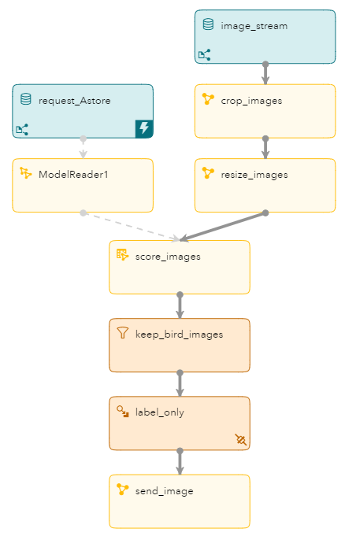

# IoT Bird watching

This is a guide for creating your own IoT bird watching project.

## Table of Contents

* [Overview](#overview)
* [Goal](#goal)
* [Prerequisites](#prerequisites)
* [Installation Steps](#installation-steps)
* [From a Webcam to ESP](#from-a-webcam-to-esp)
* [Identifying Birds](#identifying-birds)
* [ESP Project](#esp-project)
* [Conclusion](#conclusion)
* [Contributing](#contributing)
* [License](#license)
* [Additional Resources](#additional-resources)

## Overview


Bird watching is a great and relaxing hobby, and by getting a bird feeder, we can enjoy as the birds come by during the day for a little snack. It's also nice to take pictures of the birds so we can find out the species and show them to our friends. Taking pictures of the birds requires us to have our phone or a camera handy whenever watching the action at the bird feeder, and being able to take a picture without scaring the birds away. Also, what if some great birds stop by for a nibble and we aren't around?


To address these issues, and bring the IoT to bird watching, @Juthika and I created a fun project with SAS software to make sure we never miss the action at our bird feeder.


## Goal


Our mission was to have a webcam watching our bird feeder take a picture every 3 seconds, send those images to SAS ESP, train a neural network model with SAS VDMML to be used in SAS ESP to determine if there is a bird in the picture and what kind of bird it is, and finally, to email us a picture of the bird and its predicted species.


## Prerequisites


1. Raspberry Pi 3B

2. Common webcam

3. SAS Visual Data Mining and Machine Learning

4. SAS Event Stream Processing


## Installation Steps


1. Connect the webcam to the raspberry pi and verify that it was taking pictures

2. Have the Raspberry Pi send the images to SAS ESP

3. Train a neural network model using SAS VDMML to identify birds

4. Have SAS ESP process and score images

5. Have SAS ESP email us with the bird's picture and predicted species


## From a Webcam to ESP


In the case that the webcam and the ESP server are running on the same machine, we can use the UVC connector to stream images and video into ESP. Although ESP can run on a Raspberry Pi 3B, we decided to use an instance of ESP running on our home server. Given that configuration, we made use of the ESP socket connector, and wrote this python code to send images from the raspberry pi to ESP:


```
import socket
import time
import os

HOST = '192.168.1.10'   # The server's hostname or IP address
PORT = 28080            # The port used by the server

with socket.socket(socket.AF_INET, socket.SOCK_STREAM) as s:
    s.connect((HOST, PORT))
    while True:
        os.system('fswebcam -r 960x720 -d /dev/video:V4L2 image.jpg')
        image=str(os.popen("base64 image.jpg | xargs -s 1000000 | sed 's/ //g'").read())
        event="i,n,"+image+"\n"
        s.sendall(str.encode(event))
        time.sleep(3)
print('Received', repr(data))
```

The only thing we had to do on the ESP side was to configure the source window to receive the images through the socket connection. Here is the code for the source window:


```
<window-source pubsub="true" insert-only="true" autogen-key="true" index="pi_EMPTY" name="image_stream">
  <schema>
    <fields>
      <field name="image" type="blob"/>
      <field name="sequence" type="int64" key="true"/>
    </fields>
  </schema>
  <connectors>
    <connector class="fs" name="image_connector">
      <properties>
        <property name="type"><![CDATA[pub]]></property>
        <property name="fsname"><![CDATA[:28080]]></property>
        <property name="fstype"><![CDATA[csv]]></property>
      </properties>
    </connector>
  </connectors>
</window-source>
```

Notice that the value for the property "fsname" is ":28080". This indicates that ESP is functioning as the socket server and is listening on port 28080, which is the same port referenced in the python socket client code above.


Now that we have images streaming into ESP, we need a neural network model to identify the birds in the images.


## Identifying Birds


We built a Convolutional Neural Network to train publicly available images of birds found in the North Carolina region. We focused on about 8 different species of birds with about 60-100 examples of each species. Image augmentation techniques were used to increase the size of the training set. We trained a RESNET-50 model using SAS DLPy using pretrained model weights provided by SAS and validated our results on a validation set. Once the model was trained the ASTORE could be downloaded very easily for deployment in ESP.

## ESP Project


Here is the ESP project we created to ingest the stream of images, identify the birds, and email the results.





Let's go through the pieces of this project one by one.


1. image_stream: This is a Source window that receives the images from the webcam. Images must be base64 encoded before they can be processed by ESP. When ingesting images, the data type of the image field must be 'blob'.


2. crop_images and resize_images: These are Calculate windows that select the area of the picture in which the birds are on the perch, and resizes the images to what the Convolutional Neural Network score code expects.


3. request_Astore: This is a Source window that receives request events that will be passed to the 'ModelReader1' window.


4. ModelReader1: This is a Model Reader window that accepts request events. A request event is a specific group of events that directs the Model Reader window to perform any of a variety of operations. In this case, we are loading an Astore file to be used in the 'score_images' window.


5. score_images: This is a Score window, and it will generate the output of the Astore file as applied to each image. In this case, the Astore gives a probability for each of the bird species potentially in each image.


6. keep_bird_images: This is a Filter window which we use to keep only images that are very likely to actually contain a bird. Due to the nature of image classification with neural networks, there will almost always be non-zero probabilities for every class. In our case, we only keep images that generate a probability greater than 50% for any class.


7. label_only: This is a Compute window which we use to keep only the image and the species identified by the neural network.


8. send_image: This is a Calculate window which we use to email the images. Since we don't have our own SMTP server set up, we execute some python code which runs a script that sends us the image with a message.


## Conclusion


This was a really fun project to create at home, and we were able to do it entirely using SAS Software. The portfolio of software that comes with SAS Viya, which includes Visual Data Mining and Machine Learning (VDMML) and Event Stream Processing (ESP), gives users control over every step of the Streaming Analytics Lifecycle.


## Contributing

Please read [CONTRIBUTING.md](CONTRIBUTING.md) for details on how to submit contributions to this project.

## License

This project is licensed under the [Apache 2.0 License](LICENSE.txt).

## Additional Resources

Additional resources might include the following:

* [SAS Analytics for IoT](https://www.sas.com/en_us/software/analytics-iot.html)
* [SAS Visual Data Mining and Machine Learning](https://www.sas.com/en_us/software/visual-data-mining-machine-learning.html)
* [SAS Event Stream Processing](https://www.sas.com/en_us/software/event-stream-processing.html)
* [SAS for Developers](https://developer.sas.com/home.html)
* [SAS Community Article](https://communities.sas.com/t5/Hacker-s-Hub-library/AIoT-Project-Bird-Watching-with-SAS/ta-p/716733)
